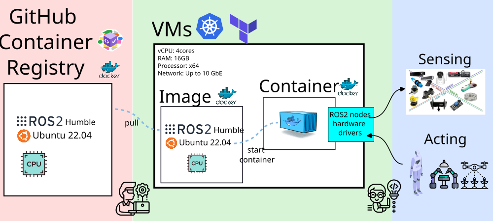
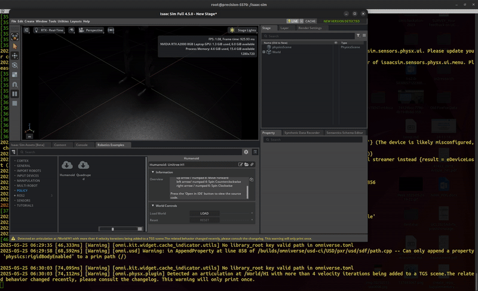
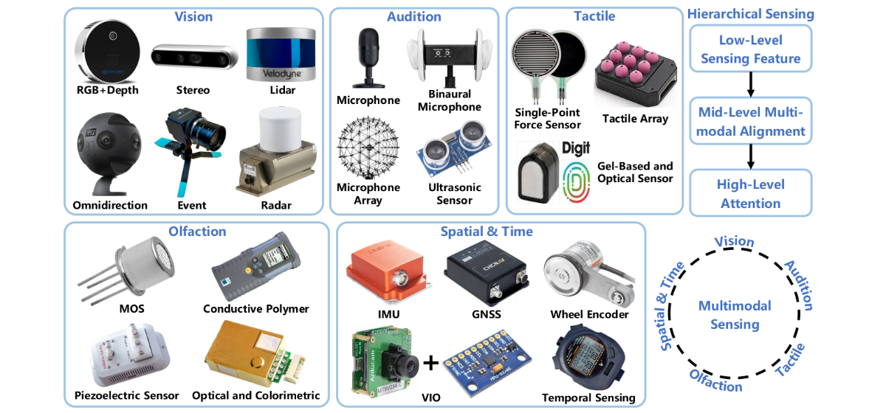
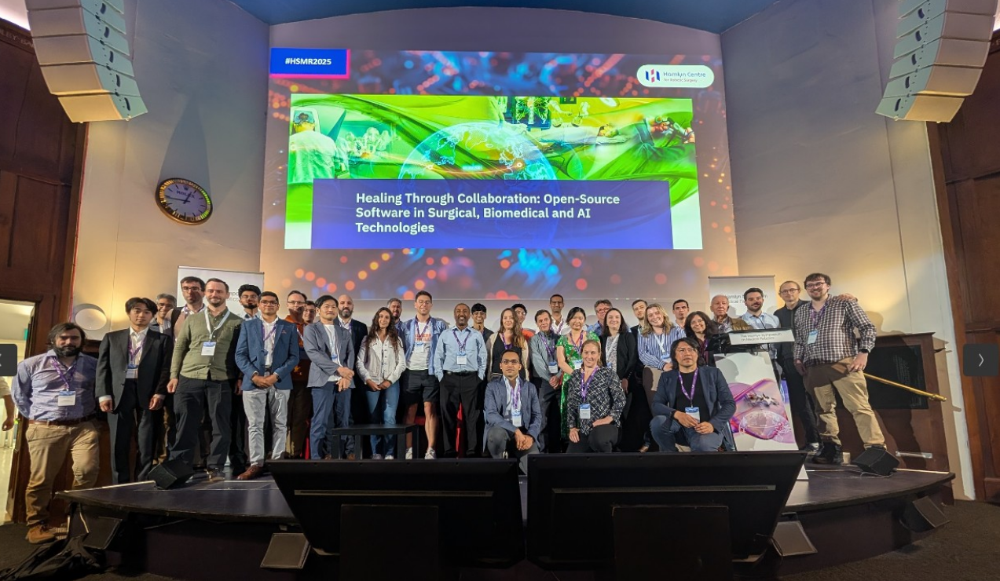

Miguel Xochicale

# 

**From Code to Care**:  
Modernizing ROS2 Skills for Orchestrating  
Cloud Brains, Physical Sensors, and Networks

Miguel Xochicale  
 UCL CEGE and ARC Teams  

Q1-2026
[(web-animations 2025 by
mxochicale)](https://mxochicale.github.io/web-animations/)

[`open-healthcare-slides`](https://github.com/mxochicale/physical-ai-in-healthcare-slides/)

<!-- *********************** NEW SLIDE *********************** -->

# Overview

- [Introduction](#Introduction)
- [UCL Infrastructure](#ucl-nfrastructure)
- [Demos](#demos)
- [Future work, Key Takeaways, Calls to Action and
  Acknowledgements](#tacfa)

<!--  Comments -->

<!--  * [Open-Source Software in Healthcare](#sec-ossh) -->

<!-- *********************** NEW SLIDE *********************** -->

# Introduction

Modernizing ROS 2 Skills

Notes goes here

<!-- *********************** NEW SLIDE *********************** -->

## :wrench: Hacking and Orchestrating Cloud Brains, Physical Sensors, and the Network

Figure 1: Cyber physical systems, cloud layer and participants

Speaker notes go here.

<!-- *********************** NEW SLIDE *********************** -->

# UCL Infrastructure

Orchestrating Cloud Brains, Physical Sensors, and the Network

Notes goes here

<!-- *********************** NEW SLIDE *********************** -->

## :robot: Orchestrating UCL infrastructure

Figure 2: Servers in UCL infrastructure and their network communication

Speaker notes go here.

<!-- *********************** NEW SLIDE *********************** -->

# Demos

Orchestrating Cloud Brains, Physical Sensors, and the Network

Notes goes here

<!-- *********************** NEW SLIDE *********************** -->

## Demos: VM↔VM and Bare-metal↔VM Communication with `zenoh-plugin-ros2dds`

- Docker container with ROS2 dependencies
- Github Container Registry
- VMs managed with terraform and kubernetes (k8s)

Figure 3: Hacking and connecting workflow

Speaker notes go here.

<!-- *********************** NEW SLIDE *********************** -->

## Demos: IsaacSim and IsaacLab

Figure 4: IsaacSim IDE with robot simple key control

Figure 5: Franka Lift Cube (RL Training)

Speaker notes go here.

<!-- *********************** NEW SLIDE *********************** -->

# Future work, Key Takeaways, Calls to Action and Acknowledgements

Notes goes here

<!-- *********************** NEW SLIDE *********************** -->

## Future work: Multimodal Sensing

Figure 6: Fig 11 from **Liu et al. 2025** *Neural Brain: A
Neuroscience-inspired Framework for Embodied Agents* [arXiv preprint:
2505.07634](https://arxiv.org/abs/2505.07634)

Speaker notes go here. Getting started documentation provide with a
range of links to setup, use, run and debug application including github
workflow.

<!-- *********************** NEW SLIDE *********************** -->

## Future work: Developing Embodied Agents

Figure 7: Fig 15 from **Liu et al. 2025** *Neural Brain: A
Neuroscience-inspired Framework for Embodied Agents* [arXiv preprint:
2505.07634](https://arxiv.org/abs/2505.07634)

<!-- *********************** NEW SLIDE *********************** -->

## Future events: Hamlyn Workshop 2025

- 50 partcipants, 10 speakers, 6 posters presenters and sold out event!
- *Open-Source development in Medical Robotics* **Late June 2026 at
  London, UK**

Figure 8: Participants of our 2025 event, [details
here](https://www.hamlynsymposium.org/events/healing-through-collaboration-open-source-software-in-surgical-biomedical-and-ai-technologies/)

Speaker notes go here.

<!-- *********************** NEW SLIDE *********************** -->

## Key Takeaways & Why This Matters

- Lowering the Barrier to Advanced Robotics at Scale
  - 

    Cloud-ready, cost-aware infrastructure enables hands-on robotics
    training and research using real sensors, networks, and constraints.

    

- A Proven, Scalable Model for Collaboration
  - 

    High-performance networking and shared platforms make
    cross-department and cross-institution collaboration practical and
    repeatable.

    

- A Testbed for Research, Training, and Innovation
  - 

    The testbed supports skills transfer, research experimentation, and
    the rapid development of new robotics workflows.

    

- Call to Action
  - 

    Partner with us to extend the testbed, through collaboration and
    funding to scale training, expand research use cases, and deploy
    models beyond a single institution.

    

**Sciortino et al. 2017** in Computers in Biology and Medicine
https://doi.org/10.1016/j.compbiomed.2017.01.008;  
**He et al. 2021** in Front. Med.
https://doi.org/10.3389/fmed.2021.729978

1.  Lowering the Barrier to Advanced Robotics
2.  A Scalable Model for Cross-Department Collaboration
3.  Real Sensors, Real Networks, Real Constraints
4.  High-Performance Networking Enables New Workflows
5.  Cloud-Ready Robotics Training at Scale
6.  Hands-On Learning Accelerates Skills Transfer
7.  Cost-Aware, Sustainable Infrastructure Design
8.  A Testbed for Research, Training, and Innovation
9.  Clear Opportunities for Collaboration & Funding

<!-- *********************** NEW SLIDE *********************** -->

## Thank You to UCL colleagues. Let’s Connect!

- UCL CEGE: UCL Civil, Environmental and Geomatic Engineering:  
  [Mickey Li](https://github.com/mhl787156), [Chris
  Bendkowski](https://github.com/ctbend)

- UCL ARC: UCL Advanced Research Computing Centre:  
  [Marlon Wijeyasinghe](https://github.com/mwij02), [James
  Legg](https://github.com/cjlegg), [Mack
  Nixon](https://github.com/TOADD), [Mahmoud
  Abdelrazek](https://github.com/TOADD), [Sunny
  Park](https://github.com/TOADD), [Emily
  Dubrovska](https://github.com/pineapple-cat), [Yagmur
  Ozdemir](https://github.com/yidilozdemir), [Ruaridh
  Gollifer](https://github.com/ruaridhg), [Samantha
  Ahern](https://github.com/quirksahern), [Miguel
  Xochicale](https://github.com/mxochicale), [James
  Hetherington](https://github.com/jamespjh)

  - Unified-AI team: Andrew Esterson and Sylvie Ramos
  - Condenser team: Sam Reece and Brian Maher

- Get in touch! GitHub: <https://github.com/mxochicale>

Notes goes here

<!-- *********************** NEW SLIDE *********************** -->

# Extra slides

Notes goes here

<!-- *********************** NEW SLIDE *********************** -->

## Miguel Xochicale

Notes goes here for my journey

