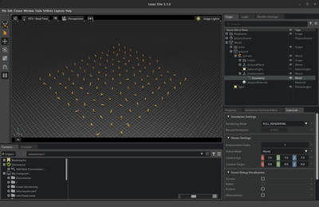
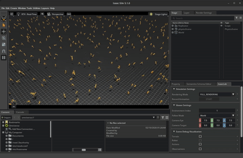
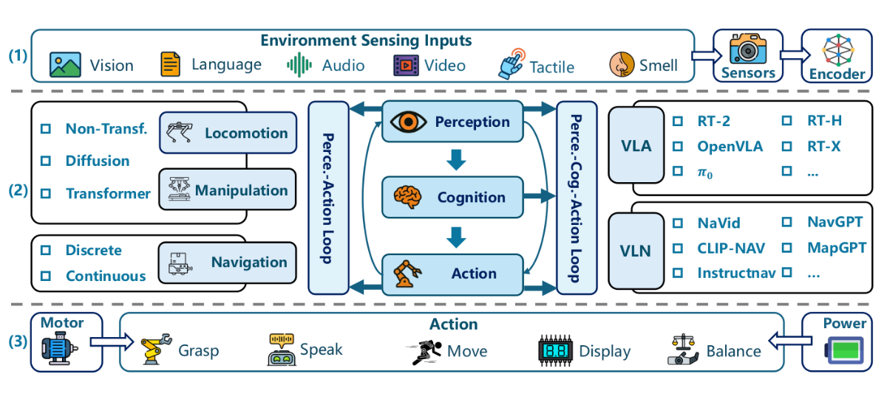

# {.title-slide .centeredslide background-iframe="https://mxochicale.github.io/web-animations/" loading="lazy"}

::: {style="background-color: rgba(22,22,22,0.75); border-radius: 10px; text-align:center; padding: 0px; padding-left: 1.5em; padding-right: 1.5em; max-width: min-content; min-width: max-content; margin-left: auto; margin-right: auto; padding-top: 0.2em; padding-bottom: 0.2em; line-height: 1.5em!important;"}

**From Code to Care**:   
Modernizing ROS2 Skills for Orchestrating     
Cloud Brains, Physical Sensors, and Networks  

  

[
Miguel Xochicale     
[](http://name-surname.github.io/) UCL CEGE and ARC Teams    
]{style="font-size:0.55em;"}

:::

::: footer
[Q1-2026 [(web-animations 2025 by mxochicale)](https://mxochicale.github.io/web-animations/)]{.dim-text style="text-align:left;'}
:::

::: {.notes}
  [[`open-healthcare-slides`](https://github.com/mxochicale/physical-ai-in-healthcare-slides/)]{style="border-bottom: 0.5px solid #00ccff;"}
:::

<!-- *********************** NEW SLIDE *********************** -->
# Overview {style="font-size: 60%;"} 

* [Introduction](#Introduction)
* [UCL Infrastructure](#ucl-nfrastructure)
* [Demos](#demos)
* [Future work, Key Takeaways, Calls to Action and Acknowledgements](#tacfa)

<!--  Comments -->
<!--  * [Open-Source Software in Healthcare](#sec-ossh) -->

<!-- *********************** NEW SLIDE *********************** -->
# Introduction {#Introduction}
Modernizing ROS 2 Skills

::: {.notes}
  Notes goes here
:::

<!-- *********************** NEW SLIDE *********************** -->
## :wrench: Hacking and Orchestrating Cloud Brains, Physical Sensors, and the Network   

::: {#fig-template}

{fig-align=center}

Cyber physical systems, cloud layer and participants
:::

::: {.notes}
Speaker notes go here.
:::

<!-- *********************** NEW SLIDE *********************** -->
# UCL Infrastructure {#ucl-nfrastructure}
Orchestrating Cloud Brains, Physical Sensors, and the Network   

::: {.notes}
  Notes goes here
:::

<!-- *********************** NEW SLIDE *********************** -->
## :robot: Orchestrating UCL infrastructure

::: {#fig-template}

{fig-align=center}

Servers in UCL infrastructure and their network communication
:::

::: {.notes}
Speaker notes go here.
:::

<!-- *********************** NEW SLIDE *********************** -->
# Demos {#demos}
Orchestrating Cloud Brains, Physical Sensors, and the Network

::: {.notes}
  Notes goes here
:::

<!-- *********************** NEW SLIDE *********************** -->
## Demos: VM↔VM and Bare-metal↔VM Communication with `zenoh-plugin-ros2dds`

:::: {.columns}

::: {.column width="35%"}

* Docker container with ROS2 dependencies
* Github Container Registry
* VMs managed with terraform and kubernetes (k8s)

:::

::: {.column width="65%"}

::: {#fig-template}
{fig-align=center}

Hacking and connecting workflow
:::

:::

::::

::: {.notes}
Speaker notes go here.
:::

<!-- *********************** NEW SLIDE *********************** -->
## Demos: IsaacSim and IsaacLab

:::: {.columns}

::: {.column width="35%"}

{fig-align=center}

{fig-align=center}

:::

::: {.column width="60%"}

{fig-align=center}

{fig-align=center}

:::

::::

::: {.notes}
IsaacSim IDE with robot simple key control
Franka Lift Cube (RL Training)

:::

<!-- *********************** NEW SLIDE *********************** -->
# Future work, Key Takeaways, Calls to Action and Acknowledgements {#tacfa}

::: {.notes}
  Notes goes here
:::

<!-- *********************** NEW SLIDE *********************** -->
## Future work: Multimodal Sensing

::: {#fig-template}

{fig-align=center}

Fig 11 from **Liu et al. 2025** _Neural Brain: A Neuroscience-inspired Framework for Embodied Agents_ [arXiv preprint: 2505.07634](https://arxiv.org/abs/2505.07634)

:::

::: {.notes}
Speaker notes go here.
Getting started documentation provide with a range of links to setup, use, run and debug application including github workflow. 
:::

<!-- *********************** NEW SLIDE *********************** -->
## Future work: Developing Embodied Agents

::: {#fig-template}

{fig-align=center}

Fig 15 from **Liu et al. 2025** _Neural Brain: A Neuroscience-inspired Framework for Embodied Agents_ [arXiv preprint: 2505.07634](https://arxiv.org/abs/2505.07634)
:::

<!-- *********************** NEW SLIDE *********************** -->
## Future events: Hamlyn Workshop 2025
:::: {.columns}

::: {.column width="30%"}

* 50 partcipants, 10 speakers, 6 posters presenters and sold out event!
* _Open-Source development in Medical Robotics_
**Late June 2026 at London, UK** 

:::

::: {.column width="70%"}

::: {#fig-template}

{fig-align=center}

Participants of our 2025 event, [details here](https://www.hamlynsymposium.org/events/healing-through-collaboration-open-source-software-in-surgical-biomedical-and-ai-technologies/)
:::

:::

::::

::: {style="font-size: 50%;"}

**Open@UCL Blog**, Sep 2025, _Shaping Tomorrow’s Healthcare: Unlocking the Power of Open-Source AI and Robotics_
[link](https://blogs.ucl.ac.uk/open-access/2025/09/17/unlocking-the-power-of-open-source-ai-and-robotics/).

:::

::: {.notes}
Speaker notes go here.
:::

<!-- *********************** NEW SLIDE *********************** -->
## Key Takeaways & Why This Matters

* Lowering the Barrier to Advanced Robotics at Scale       
    * ::: {style="font-size: 60%;"}
Cloud-ready, cost-aware infrastructure enables hands-on robotics training and 
research using real sensors, networks, and constraints.
:::

* A Proven, Scalable Model for Collaboration   
    * ::: {style="font-size: 60%;"}
High-performance networking and shared platforms make cross-department 
and cross-institution collaboration practical and repeatable.
:::

* A Testbed for Research, Training, and Innovation
    * ::: {style="font-size: 60%;"}
The testbed supports skills transfer, research experimentation, and 
the rapid development of new robotics workflows.
:::

* Call to Action  
    * ::: {style="font-size: 60%;"}
Partner with us to extend the testbed, through collaboration and funding to scale training, 
expand research use cases, and deploy models beyond a single institution.
:::

::: {style="font-size: 40%;"}
**Sciortino et al. 2017** in Computers in Biology and Medicine https://doi.org/10.1016/j.compbiomed.2017.01.008;      
**He et al. 2021** in Front. Med. https://doi.org/10.3389/fmed.2021.729978
:::

::: {.notes}

1. Lowering the Barrier to Advanced Robotics
2. A Scalable Model for Cross-Department Collaboration
3. Real Sensors, Real Networks, Real Constraints
4. High-Performance Networking Enables New Workflows
5. Cloud-Ready Robotics Training at Scale
6. Hands-On Learning Accelerates Skills Transfer
7. Cost-Aware, Sustainable Infrastructure Design
8. A Testbed for Research, Training, and Innovation
9. Clear Opportunities for Collaboration & Funding

:::

<!-- *********************** NEW SLIDE *********************** -->
## Thank You to UCL colleagues. Let's Connect!

* UCL CEGE: UCL Civil, Environmental and Geomatic Engineering:    
[Mickey Li](https://github.com/mhl787156), 
[Chris Bendkowski](https://github.com/ctbend)

* UCL ARC: UCL Advanced Research Computing Centre:    
[Marlon Wijeyasinghe](https://github.com/mwij02), 
[James Legg](https://github.com/cjlegg), 
[Mack Nixon](https://github.com/TOADD), 
[Mahmoud Abdelrazek](https://github.com/TOADD), 
[Sunny Park](https://github.com/TOADD), 
[Emily Dubrovska](https://github.com/pineapple-cat), 
[Yagmur Ozdemir](https://github.com/yidilozdemir), 
[Ruaridh Gollifer](https://github.com/ruaridhg), 
[Samantha Ahern](https://github.com/quirksahern), 
[Miguel Xochicale](https://github.com/mxochicale), 
[James Hetherington](https://github.com/jamespjh) 

	* Unified-AI team: Andrew Esterson and Sylvie Ramos
	* Condenser team: Sam Reece and Brian Maher

* Get in touch! GitHub: [https://github.com/mxochicale](https://github.com/mxochicale)

::: {style="font-size: 40%;"}
:::

::: {.notes}
  Notes goes here
:::

<!-- *********************** NEW SLIDE *********************** -->
# Extra slides

::: {.notes}
  Notes goes here
:::

<!-- *********************** NEW SLIDE *********************** -->
## Miguel Xochicale

::: {#sec-mt style="margin-top: 0px; font-size: 50%;"} 
{fig-align="center" width="100%"}
:::

::: {.notes}
  Notes goes here for my journey
:::
